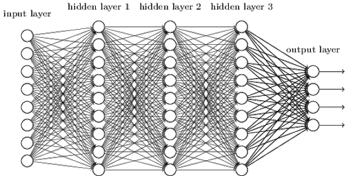

# Skyplay-NN

A neural network playground build from scratch using Python

## So, What is a Neural Network?
It’s a set of algorithms designed to recognise patterns for building a computer program that learns from data. It is based very loosely on how we think the human brain works. First, a collection of software “neurons” are created and connected together, allowing them to send messages to each other. Next, the network is asked to solve a problem, which it attempts to do over and over, each time strengthening the connections that lead to success and diminishing those that lead to failure.



## Where Are They Used?
Today, neural networks are used for solving many business problems such as sales forecasting, customer research etc. They have turned into a very popular and useful tool in solving many problems such as text Classification and Categorization, Regression, pattern recognition, Named Entity Recognition (NER), Part-of-Speech Tagging, Language Generation and Multi-document Summarization, etc.

## What are Parameters & Hyperparameters
A model parameter is a configuration variable that is internal to the model and whose value can be estimated from data. Parameters are key to machine learning algorithms. Hyperparameters are adjustable parameters that must be tuned in order to obtain a model with optimal performance. They are the part of the model that is learned from historical training data and are often not set manually by the practitioner.

So, how can we improve the accuracy of the model? Is there any way to speed up the training process? These are critical questions to ask, whether you’re in a hackathon setting or working on a client project. And these aspects become even more prominent when you’ve built a deep neural network. Features like hyperparameter tuning, regularization, batch normalization, etc. helps in fine tuning your model.

## Parameters
<b>Weights</b> - When input enters the neuron, it is multiplied by a weight.For example, if a neuron has two inputs, then each input will have has an associated weight assigned to it. We initialize the weights randomly and these weights are updated during the model training process.

<b>Biases</b> - A bias is added to the result of weight multiplication to the input. It is basically added to change the range of the weight multiplied input. This is the final linear component of the input transformation.

For more information on this we recommend going through Part 2 of the deeplearning.ai course (Deep Learning Specialization) taught by the great Andrew Ng. We saw the basics of neural networks and how to implement them in part 1, and I recommend going through that if you need a quick refresher.

## Hyperparameters
<ul>
<li>No. of Epochs</li>
<li>Batch Size</li>
<li>#layers</li>
<li>Learning Rate</li>
<li>Hidden Units</li>
<li>Activation Function</li>
<li>Train/Test/Dev Split</li>
</ul>


## Methods Used to Tune Hyperparameters
<ul>
<li>Manual Search</li>
<li>Grid Search</li>
<li>Random Search</li>
<li>Bayesian Optimization</li>
</ul>


## What Are We Using?
We wrote this neural network code completely from scratch. We were inspired by our course instructor Andrew Ng and felt the urge to create a platform where everybody could visualise the effects of tuning different parameters, building your own neural network, uploading different datasets and so on.


## Getting started

1. Clone the repository
```bash
git clone https://github.com/sherwyn11/NN-Playground.git
```
2. Start a virtural environment eg.conda (Recommended)
```bash
conda activate <my_virtual_env>
```

3. Download the requirements
```bash
pip install requirements.txt
```

4. Start the server
```bash
python wsgi.py
```

## Working Demonstration


## Technology Stack

<ul>
<li>Python v3</li>
<li>Flask</li>
<li>Numpy</li>
<li>Pandas</li>
<li>MatPlotLib</li>
<li>Seaborn</li>
<li>D3.js</li>
<li>JavaScript</li>
<li>JQuery</li>
<li>HTML5</li>
<li>CSS3</li>
<li>Bootstrap</li>
<li>Material Design Lite</li>
</ul>

## Task List

### Activation Functions         
- [x] Sigmoid
- [x] ReLU
- [x] Leaky ReLU
- [x] Tanh
- [ ] Softmax
### Regularization
- [x] L1
- [x] L2
### Activation Functions         
- [x] SGD
- [x] GD
- [x] GD with Momentum
- [x] RMS Prop
- [x] Adam
### Neural Network
- [x] Forward Propagation
- [x] Backward Propagation
- []


- [x] Classification/Regression on single class Structured data
- [x] Added different types of activation functions
- [x] News updates
- [ ] Multi-class Classification
- [ ] Unstructured Data 
- [ ] Fix small bugs

## Contributors

Made with 💙 by <a href="https://github.com/Darlene-Naz">Darlene Nazareth</a> and <a href="https://github.com/sherwyn11">Sherwyn D'souza</a></b>

© 2020 Copyright
